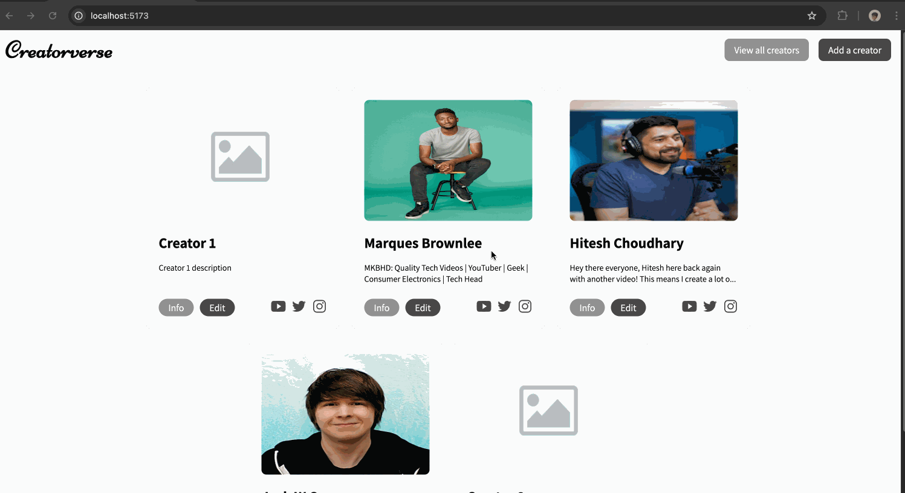

# WEB103 Prework - _Creatorverse 🚀_

Submitted by: **Veerendranath P**

About this web app: **A web application built with Vite, React, React Router v6, and Supabase that allows users to manage their favorite creators by enabling them to create, read, update, and delete records.**

Time spent: **78** hours

## Required Features

The following **required** functionality is completed:

<!-- 👉🏿👉🏿👉🏿 Make sure to check off completed functionality below -->

- [x] **A logical component structure in React is used to create the frontend of the app**
- [x] **At least five content creators are displayed on the homepage of the app**
- [x] **Each content creator item includes their name, a link to their channel/page, and a short description of their content**
- [x] **API calls use the async/await design pattern via Axios or fetch()**
- [x] **Clicking on a content creator item takes the user to their details page, which includes their name, url, and description**
- [x] **Each content creator has their own unique URL**
- [x] **The user can edit a content creator to change their name, url, or description**
- [x] **The user can delete a content creator**
- [x] **The user can add a new content creator by entering a name, url, or description and then it is displayed on the homepage**

The following **optional** features are implemented:

- [ ] Picocss is used to style HTML elements
- [x] The content creator items are displayed in a creative format, like cards instead of a list
- [x] An image of each content creator is shown on their content creator card

The following **additional** features are implemented:

- [x] Displaying a default image if the user does not provide any image link

## Video Walkthrough

Here's a walkthrough of implemented required features:

GIF created with [LICECap](https://www.cockos.com/licecap/)

## Notes

Describe any challenges encountered while building the app or any additional context you'd like to add.

- The major challenge I have faced was coming up with a new design and writing all the CSS on my own.

## Live Demo

View a live demo of the application by visiting: [creatorverse-production.vercel.app](https://creatorverse-production.vercel.app/)

## License

Copyright 2024 Veerendranath P

Licensed under the Apache License, Version 2.0 (the "License"); you may not use this file except in compliance with the License. You may obtain a copy of the License at

> http://www.apache.org/licenses/LICENSE-2.0

Unless required by applicable law or agreed to in writing, software distributed under the License is distributed on an "AS IS" BASIS, WITHOUT WARRANTIES OR CONDITIONS OF ANY KIND, either express or implied. See the License for the specific language governing permissions and limitations under the License.
